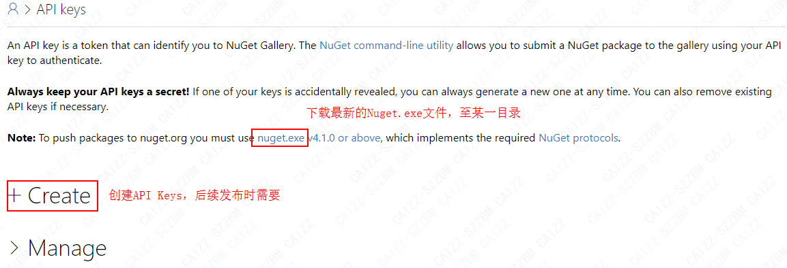
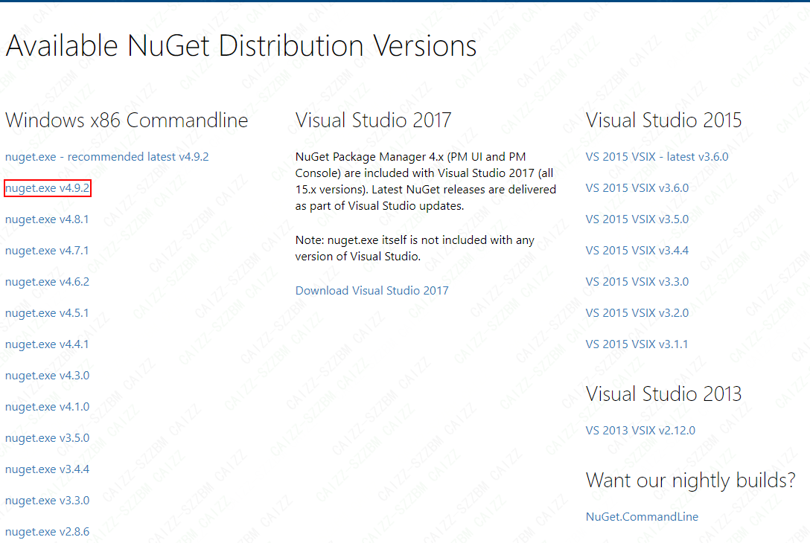
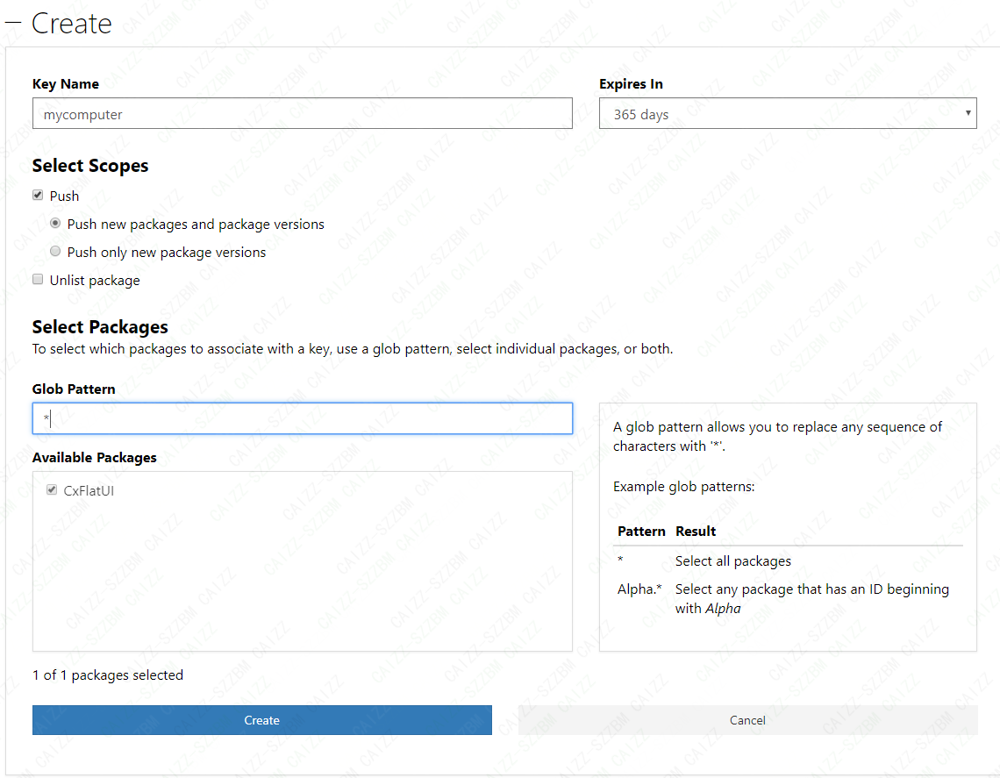
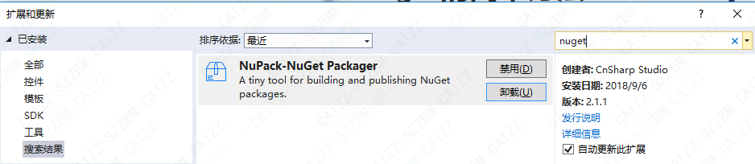
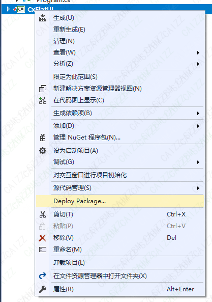
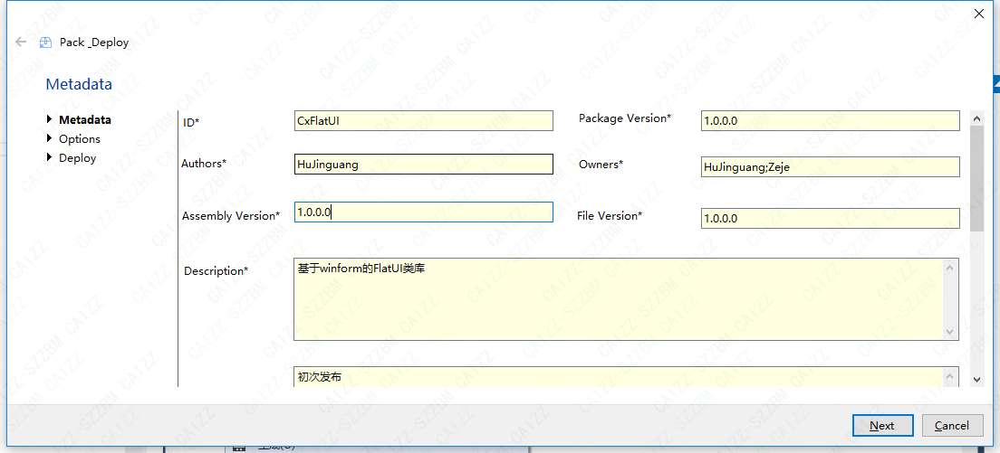
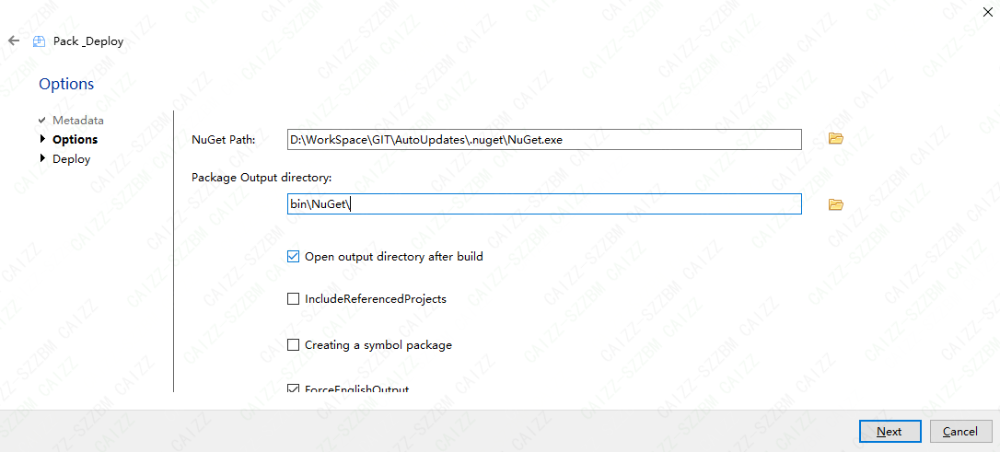

# 基于`winform`的`FlatUI`类库

基于`winform`的`FlatUI`类库

## 使用`VisualStudio`发布至`Nuget`的简单方法

### 1. 申请`nuget`账号

* #### 访问[https://www.nuget.org](https://www.nuget.org)，并注册账号
* #### 访问[https://www.nuget.org/account/apikeys](https://www.nuget.org/account/apikeys)

    * 下载`Nuget.exe`文件

    * 生成`API Keys`

### 2. （基于`Visual Studio 2017`企业版）安装`VisualStudio`插件 `NuPack-Nuget Packager`

### 3. 使用`NuPack-Nuget Packager`

* 在类库项目上右键

* #### 点击`Deploy Package`
    * 填写MetaData，点击Next

    * 填写Options，点击Next

    * 填写Deploy，点击Next

    * 若Deploy失败，则可以通过[https://www.nuget.org/packages/manage/upload](https://www.nuget.org/packages/manage/upload)，选择`bin\NuGet`下的`.nupkg`文件，进行上传。

